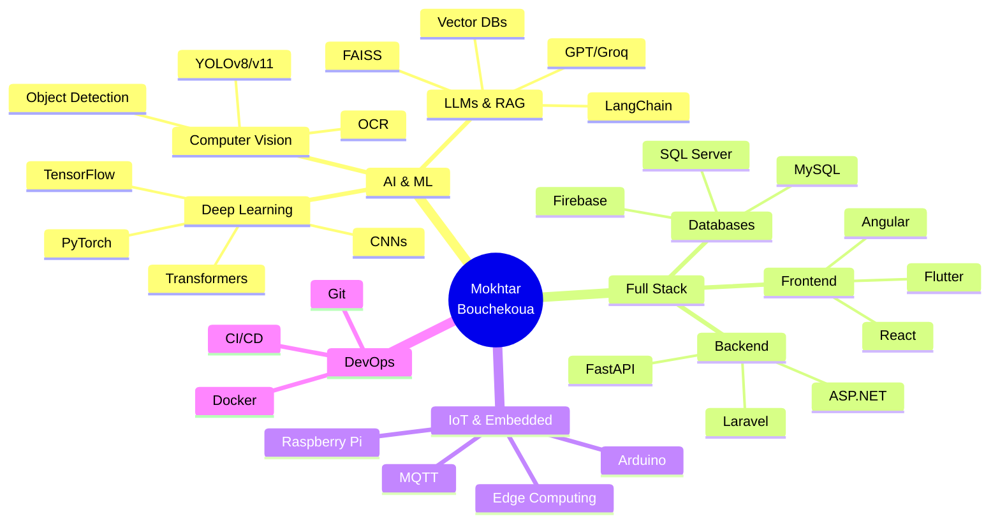

<div align="center">
  
</div>

<h3 align="center">🎓 Ingénieur Génie Logiciel @ IIT Sfax | AI & IoT Expert</h3>

<p align="center">
  <a href="https://linkedin.com/in/mokhtar-bouchekoua-084267248"></a>
  <a href="mailto:mokhtarbouchekoua@gmail.com"></a>
  <a href="tel:+21622424434"></a>
</p>

<p align="center">
  
  
  
</p>

---

## 🚀 About Me

Étudiant ingénieur en **Génie Logiciel** passionné par l'**Intelligence Artificielle**, l'**IoT** et le **développement Full Stack**. Je me spécialise dans la création de solutions innovantes combinant **Computer Vision**, **LLMs** et **architectures distribuées**.

### 🎯 Focus actuel
- 🤖 **IA Générative** : Développement d'applications basées sur les LLMs (RAG, Agents)
- 🚗 **Computer Vision** : Systèmes de reconnaissance de plaques et détection d'anomalies
- 📊 **Business Intelligence** : Dashboards décisionnels avec analyse prédictive
- 🌐 **IoT & Edge Computing** : Systèmes temps réel pour véhicules autonomes

### 🏆 Achievements
- 🥇 **Prix du Meilleur PFE 2023** - Drone agricole intelligent
- 👥 **Membre IEEE** (ISGIS & IIT)
- 📜 **Certifications** : CCNA, AWS, Python, Arduino
- 💼 **Stage MyPartner** : Module IA pour gestion de stock ERP

### 📍 Location
Sfax, Tunisia 🇹🇳

---

## 💼 Professional Experience

### 🔹 AI Developer Intern @ MyPartner
**Juillet - Août 2025** | Sfax, Tunisia

Développement d'un **module d'IA basé sur les LLMs** pour la prévision et gestion de stock dans l'ERP Paramedics.

**Réalisations :**
- ✅ Automatisation de la gestion de stock avec des modèles de langage (GPT, Groq)
- ✅ Intégration d'une **API FastAPI** connectée à l'ERP
- ✅ Architecture **RAG** pour requêtes contextuelles sur données métier
- ✅ Dashboard BI avec prédictions de stock

**Tech Stack :** `Python` `FastAPI` `React` `LangChain` `Groq` `Streamlit` `Plotly`

---

### 🔹 Full Stack Developer Intern @ Flash Marketing Digital
**Juin - Juillet 2024** | Sfax, Tunisia

Création du site e-commerce **"Allo Fruit"** avec interface admin et gestion de stock.

**Réalisations :**
- ✅ Backend Laravel complet (CRUD, commandes, stock, authentification)
- ✅ Tableau de bord React pour suivi des ventes en temps réel
- ✅ Système de paiement intégré
- ✅ Dashboard analytics avec graphiques dynamiques

**Tech Stack :** `Laravel` `React` `MySQL` `Tailwind CSS` `Chart.js`

---

### 🔹 Embedded Systems Intern @ Clinisys
**Juin - Juillet 2022** | Sfax, Tunisia

Stage d'observation : découverte du cycle complet de développement logiciel.
- Observation des processus de QA et gestion de projet
- Participation aux réunions techniques d'équipe

---

## 🎓 Education

### 🏫 Institut International de Technologie (IIT)
**Diplôme d'Ingénieur en Génie Informatique** | 2023 - Présent  
Sfax, Tunisia

**Spécialisation :** Intelligence Artificielle, IoT, Computer Vision

---

### 🏫 Institut Supérieur de Gestion Industrielle (ISGI)
**Licence en Électronique, Électrotechnique et Automatique** | 2023  
Sfax, Tunisia

---

## 🛠️ Tech Stack

### Languages


### AI & Machine Learning


**Spécialisations :**
- 🧠 **Deep Learning** : CNNs, Transformers, YOLO, Transfer Learning
- 🤖 **LLMs & RAG** : GPT, Groq, Llama, LangChain, FAISS, Vector DBs
- 👁️ **Computer Vision** : Object Detection, OCR, Image Classification
- 📊 **Machine Learning** : Regression, Classification, Clustering

### Web Development


### Mobile Development


### Databases & Tools


### IoT & Hardware


---

## 🏆 Featured Projects

<table>
<tr>
<td width="50%">

### 🅿️ [FacPark - Smart Parking System](https://github.com/Mokh-07/FacPark)
Système intelligent de gestion de parking universitaire avec reconnaissance de plaques par IA.

**Highlights :**
- YOLOv11 pour détection de plaques (>95% précision)
- OCR LPRNet pour plaques tunisiennes
- Chatbot RAG pour assistance 24/7
- Dashboard admin temps réel

**Stack :** `Python` `FastAPI` `React` `YOLOv11` `LangChain` `MySQL`


</td>
<td width="50%">

### 💊 [Paramedics BI Dashboard](https://github.com/Mokh-07/paramedics-bi-dashboard)
Dashboard BI avec IA pour analyse financière et optimisation du recouvrement.

**Highlights :**
- Score santé financière (algorithme propriétaire)
- Moteur de simulation What-If
- Assistant IA (Groq + RAG)
- Architecture Clean DDD

**Stack :** `Streamlit` `Groq` `Plotly` `LangChain` `Python`


</td>
</tr>

<tr>
<td width="50%">

### 🚗 SmartALPR - Tunisian License Plate Recognition
Système IA pour lecture automatique de plaques tunisiennes via Computer Vision, OCR et LLM/RAG.

**Highlights :**
- YOLOv8 pour détection
- EasyOCR personnalisé (arabe + latin)
- RAG pour recherche contextuelle
- API FastAPI temps réel

**Stack :** `YOLOv8` `EasyOCR` `FastAPI` `LangChain` `Python`

</td>
<td width="50%">

### 🤖 IoT Anomaly Detection System
**Projet de Fin d'Année (PFA) - En cours**

Système de détection d'anomalies IoT pour véhicules autonomes en temps réel.

**Highlights :**
- Pipeline de détection via Transformers
- Backend FastAPI avec MQTT
- Dashboard Angular temps réel
- Firebase pour stockage distribué

**Stack :** `FastAPI` `Angular` `MQTT` `Firebase` `PyTorch`

</td>
</tr>

<tr>
<td width="50%">

### 🚁 Drone Agricole Intelligent
**🏆 Prix du Meilleur PFE 2023**

Drone avec capteur NPK 7-en-1 et app Android d'analyse des sols.

**Highlights :**
- Acquisition données capteurs Arduino
- Traitement temps réel
- Interface Android visualisation
- Système d'alertes automatique

**Stack :** `Arduino` `Android Studio` `Flutter` `C`

</td>
<td width="50%">

### 🛒 Allo Fruit - E-commerce Platform
Plateforme de vente en ligne avec gestion complète.

**Highlights :**
- Backend Laravel (CRUD, commandes)
- Frontend React responsive
- Système de paiement intégré
- Dashboard analytics

**Stack :** `Laravel` `React` `MySQL` `Tailwind CSS`

</td>
</tr>
</table>

### 📦 Autres Projets

- **📊 BI Dashboard** - Tableaux de bord décisionnels avec AdventureWorks
- **🎨 JavaFX Drawing App** - Application de dessin et manipulation de formes
- **📚 E-learning Platform** - Gestion des cours et utilisateurs (ASP.NET + React)
- **💼 Various Full Stack Projects** - Laravel, React, Angular, ASP.NET

---

## 📊 GitHub Stats

<p align="center">
  
  
</p>

<p align="center">
  
</p>

<p align="center">
  
</p>

---

## 🎓 Certifications & Training

<table>
<tr>
<td align="center" width="25%">
<br/>
<b>Cisco CCNA</b><br/>
Network Fundamentals
</td>
<td align="center" width="25%">
<br/>
<b>AWS Badge</b><br/>
Cloud Computing
</td>
<td align="center" width="25%">
<br/>
<b>Python Certificate</b><br/>
Advanced Programming
</td>
<td align="center" width="25%">
<br/>
<b>Arduino Training</b><br/>
Embedded Systems
</td>
</tr>
</table>

---

## 📈 Current Learning Path

```python
learning_roadmap = {
    "2026_Q1": [
        "Advanced RAG Techniques (Agentic RAG, Multi-Query)",
        "MLOps & Model Deployment (MLflow, Kubernetes)",
        "Computer Vision Advanced (Segmentation, 3D Vision)"
    ],
    "2026_Q2": [
        "Edge AI & TinyML (TensorFlow Lite, ONNX)",
        "Cloud Architecture (AWS/GCP Certified)",
        "Distributed Systems & Microservices"
    ],
    "next": "Open to new challenges and collaborations!"
}
```

---

## 💡 Skills Summary



---

## 🤝 Let's Connect!

Je suis toujours ouvert à des projets innovants, des collaborations et des opportunités professionnelles dans les domaines de l'**IA**, l'**IoT**, et le **développement Full Stack**.

<p align="center">
  <a href="https://linkedin.com/in/mokhtar-bouchekoua-084267248">
    
  </a>
  <a href="mailto:mokhtarbouchekoua@gmail.com">
    
  </a>
  <a href="tel:+21622424434">
    
  </a>
</p>

### 💬 Ask me about:
- 🤖 AI & Machine Learning implementation
- 👁️ Computer Vision projects (YOLO, OCR)
- 🦜 LLMs & RAG architectures
- 🌐 Full Stack development (React, FastAPI, Laravel)
- 📱 Mobile app development (Flutter, Android)
- 🔌 IoT & Embedded systems

### 🎯 Open to:
- Full-time positions in AI/ML Engineering
- Freelance projects
- Research collaborations
- Open source contributions
- Technical discussions and mentorship

---

<div align="center">

**"Code is like humor. When you have to explain it, it's bad." - Cory House**

⭐ From [Mokh-07](https://github.com/Mokh-07) with ❤️


</div>
