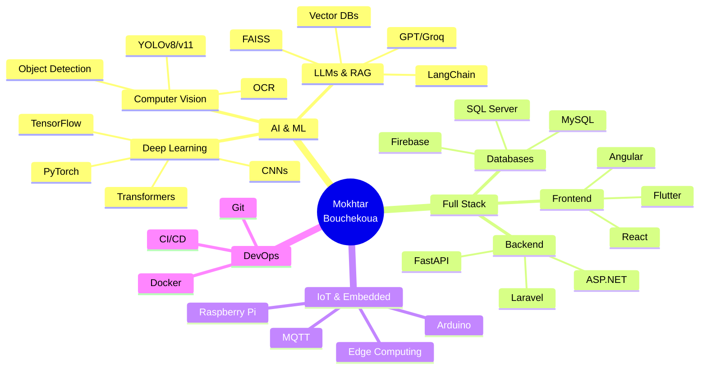

<div align="center">
  
</div>

<h3 align="center">🎓 Software Engineer @ IIT Sfax | AI & IoT Expert</h3>

<p align="center">
  <a href="https://linkedin.com/in/mokhtar-bouchekoua-084267248"></a>
  <a href="mailto:mokhtarbouchekoua@gmail.com"></a>
</p>

<p align="center">
  
  
  
</p>

---

## 🚀 About Me

Software Engineering student passionate about **Artificial Intelligence**, **IoT**, and **Full Stack Development**. I specialize in creating innovative solutions combining **Computer Vision**, **LLMs**, and **distributed architectures**.

### 🎯 Current Focus
- 🤖 **Generative AI**: Building LLM-powered applications (RAG, Agents)
- 🚗 **Computer Vision**: License plate recognition and anomaly detection systems
- 📊 **Business Intelligence**: Decision dashboards with predictive analytics
- 🌐 **IoT & Edge Computing**: Real-time systems for autonomous vehicles

### 🏆 Achievements
- 🥇 **Best Final Year Project Award 2023** - Smart Agricultural Drone
- 👥 **IEEE Member** (ISGIS & IIT)
- 📜 **Certifications**: CCNA, AWS, Python, Arduino
- 💼 **MyPartner Internship**: AI module for ERP stock management

### 📍 Location
Sfax, Tunisia 🇹🇳

---

## 💼 Professional Experience

### 🔹 AI Developer Intern @ MyPartner
**July - August 2025** | Sfax, Tunisia

Development of an **LLM-based AI module** for stock forecasting and management in Paramedics ERP.

**Key Achievements:**
- ✅ Automated stock management using language models (GPT, Groq)
- ✅ Integrated **FastAPI backend** connected to ERP system
- ✅ **RAG architecture** for contextual queries on business data
- ✅ BI dashboard with stock predictions

**Tech Stack:** `Python` `FastAPI` `React` `LangChain` `Groq` `Streamlit` `Plotly`

---

### 🔹 Full Stack Developer Intern @ Flash Marketing Digital
**June - July 2024** | Sfax, Tunisia

Created **"Allo Fruit"** e-commerce website with admin interface and inventory management.

**Key Achievements:**
- ✅ Complete Laravel backend (CRUD, orders, stock, authentication)
- ✅ React dashboard for real-time sales tracking
- ✅ Integrated payment system
- ✅ Analytics dashboard with dynamic charts

**Tech Stack:** `Laravel` `React` `MySQL` `Tailwind CSS` `Chart.js`

---

### 🔹 Embedded Systems Observer @ Clinisys
**June - July 2022** | Sfax, Tunisia

Observational internship: discovered the complete software development cycle.
- Observed QA processes and project management
- Participated in technical team meetings

---

## 🎓 Education

### 🏫 International Institute of Technology (IIT)
**Software Engineering Degree** | 2023 - Present  
Sfax, Tunisia

**Specialization:** Artificial Intelligence, IoT, Computer Vision

---

### 🏫 Higher Institute of Industrial Management (ISGI)
**Bachelor's in Electronics, Electrical Engineering & Automation** | 2023  
Sfax, Tunisia

---

## 🛠️ Tech Stack

### Languages


### AI & Machine Learning


**Specializations:**
- 🧠 **Deep Learning**: CNNs, Transformers, YOLO, Transfer Learning
- 🤖 **LLMs & RAG**: GPT, Groq, Llama, LangChain, FAISS, Vector DBs
- 👁️ **Computer Vision**: Object Detection, OCR, Image Classification
- 📊 **Machine Learning**: Regression, Classification, Clustering

### Web Development


### Mobile Development


### Databases & DevOps


### IoT & Hardware


---

## 🏆 Featured Projects

<table>
<tr>
<td width="50%">

### 🅿️ [FacPark - Smart Parking System](https://github.com/mokhtar-bouchekoua/FacPark)
Intelligent university parking management system with AI-powered license plate recognition.

**Highlights:**
- YOLOv11 for plate detection (>95% accuracy)
- LPRNet OCR for Tunisian plates
- RAG chatbot for 24/7 assistance
- Real-time admin dashboard

**Stack:** `Python` `FastAPI` `React` `YOLOv11` `LangChain` `MySQL`


</td>
<td width="50%">

### 💊 [Paramedics BI Dashboard](https://github.com/mokhtar-bouchekoua/paramedics-bi-dashboard)
AI-powered BI dashboard for financial analysis and receivables optimization.

**Highlights:**
- Financial health score (proprietary algorithm)
- What-If simulation engine
- AI Assistant (Groq + RAG)
- Clean Architecture DDD

**Stack:** `Streamlit` `Groq` `Plotly` `LangChain` `Python`


</td>
</tr>

<tr>
<td width="50%">

### 🤖 IoT Anomaly Detection System
**Final Year Project (PFA) - Ongoing**

Real-time IoT anomaly detection system for autonomous vehicles.

**Highlights:**
- Detection pipeline via Transformers
- FastAPI backend with MQTT
- Real-time Angular dashboard
- Firebase for distributed storage

**Stack:** `FastAPI` `Angular` `MQTT` `Firebase` `PyTorch`

</td>
<td width="50%">

### 🚁 Smart Agricultural Drone
**🏆 Best Final Year Project Award 2023**

Drone with NPK 7-in-1 sensor and Android app for soil analysis.

**Highlights:**
- Arduino sensor data acquisition
- Real-time processing
- Android visualization interface
- Automatic alert system

**Stack:** `Arduino` `Android Studio` `Flutter` `C`

</td>
</tr>

<tr>
<td width="50%">

### 🛒 Allo Fruit - E-commerce Platform
Complete online sales platform with full management.

**Highlights:**
- Laravel backend (CRUD, orders)
- Responsive React frontend
- Integrated payment system
- Analytics dashboard

**Stack:** `Laravel` `React` `MySQL` `Tailwind CSS`

</td>
<td width="50%">

### 📊 Business Intelligence Dashboard
Decision dashboards with advanced analytics.

**Highlights:**
- AdventureWorks database integration
- Interactive data visualizations
- Real-time reporting
- KPI tracking

**Stack:** `Power BI` `SQL Server` `Python`

</td>
</tr>
</table>

### 📦 Other Projects

- **🎨 JavaFX Drawing App** - Drawing and shape manipulation application
- **📚 E-learning Platform** - Course and user management (ASP.NET + React)
- **💼 Various Full Stack Projects** - Laravel, React, Angular, ASP.NET

---

## 📊 GitHub Stats

<p align="center">
  
  
</p>

<p align="center">
  
</p>

<p align="center">
  
</p>

---

## 🎓 Certifications & Training

<table>
<tr>
<td align="center" width="25%">
<br/>
<b>Cisco CCNA</b><br/>
Network Fundamentals
</td>
<td align="center" width="25%">
<br/>
<b>AWS Badge</b><br/>
Cloud Computing
</td>
<td align="center" width="25%">
<br/>
<b>Python Certificate</b><br/>
Advanced Programming
</td>
<td align="center" width="25%">
<br/>
<b>Arduino Training</b><br/>
Embedded Systems
</td>
</tr>
</table>

---

## 📈 Current Learning Path

```python
learning_roadmap = {
    "2026_Q1": [
        "Advanced RAG Techniques (Agentic RAG, Multi-Query)",
        "MLOps & Model Deployment (MLflow, Kubernetes)",
        "Computer Vision Advanced (Segmentation, 3D Vision)"
    ],
    "2026_Q2": [
        "Edge AI & TinyML (TensorFlow Lite, ONNX)",
        "Cloud Architecture (AWS/GCP Certified)",
        "Distributed Systems & Microservices"
    ],
    "next": "Open to new challenges and collaborations!"
}
```

---

## 💡 Skills Summary



---

## 🤝 Let's Connect!

I'm always open to innovative projects, collaborations, and professional opportunities in **AI**, **IoT**, and **Full Stack Development**.

<p align="center">
  <a href="https://linkedin.com/in/mokhtar-bouchekoua-084267248">
    
  </a>
  <a href="mailto:mokhtarbouchekoua@gmail.com">
    
  </a>
</p>

### 💬 Ask me about:
- 🤖 AI & Machine Learning implementation
- 👁️ Computer Vision projects (YOLO, OCR)
- 🦜 LLMs & RAG architectures
- 🌐 Full Stack development (React, FastAPI, Laravel)
- 📱 Mobile app development (Flutter, Android)
- 🔌 IoT & Embedded systems

### 🎯 Open to:
- Full-time positions in AI/ML Engineering
- Freelance projects
- Research collaborations
- Open source contributions
- Technical discussions and mentorship

---

<div align="center">

**"Code is like humor. When you have to explain it, it's bad." - Cory House**

⭐ From [mokhtar-bouchekoua](https://github.com/mokhtar-bouchekoua) with ❤️


</div>
